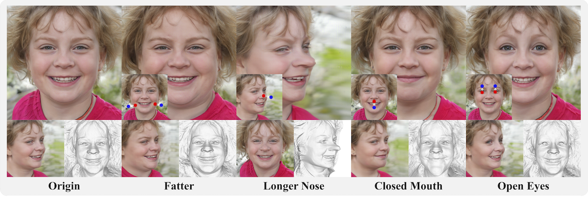
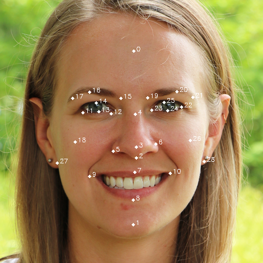

# FaceEdit3D 
### 3D-Aware Face Editing via Warping-Guided Latent Direction Learning

Yuhao Cheng, Zhuo Chen, Xingyu Ren, Wenhan Zhu, Zhengqin Xu, Di Xu, Changpeng Yang, Yichao Yan

CVPR 2024

[Paper](https://openaccess.thecvf.com/content/CVPR2024/papers/Cheng_3D-Aware_Face_Editing_via_Warping-Guided_Latent_Direction_Learning_CVPR_2024_paper.pdf) | [Project page](https://cyh-sj.github.io/FaceEdit3D/)



## Requirements
+ Please refer to eg3d installation guidelines: <a href='https://github.com/NVlabs/eg3d'>https://github.com/NVlabs/eg3d</a>.

+ Download pretrained eg3d models _ffhqrebalanced512-128.pkl_  from <a href='https://github.com/NVlabs/eg3d/blob/main/docs/models.md'>https://github.com/NVlabs/eg3d/blob/main/docs/models.md</a>, and put it in _Codes_.

+ Install Mediapipe: <a href='https://github.com/google-ai-edge/mediapipe'>https://github.com/google-ai-edge/mediapipe</a>.

+ Download pretrained warp-aware encoder models from <a href='https://drive.google.com/file/d/1L576COZyXX0Lwz8U71NbJ2Vtp7SZBZY0/view?usp=sharing'>https://drive.google.com/file/d/1L576COZyXX0Lwz8U71NbJ2Vtp7SZBZY0/view?usp=sharing</a>, and put it in _Codes_.

## Editing
+ For one random seed, e.g., 0, you can obtain a facial image with its 3D landmarks.
```.bash
python generate_3D_landmarks.py --seeds 0
```

+ Then, you will obtain a source_3d_ldms.txt and a target_3d_ldms.txt, then you can edit the locations of ldms in target_3d_ldms.txt.

+ You can obtain warped images with:
```.bash
python gen_warped_images.py --outdir=out --network=ffhqrebalanced512-128.pkl
```

+ You can obtain final edited images with:
```.bash
python gen_inversion_warped_images.py --outdir=out --network=ffhqrebalanced512-128.pkl

# --edit_shape controls editing facial shape, and --edit_exp controls editing facial expressions.
# We also provide some editing directions in editing_direction, which can be used by --direction.
```

## Definition of the landmarks



## Acknowledgements
Some functions or scripts in this implementation are inspired by external sources. We appreciate the authors for their excellent work.

Here are some valuable resources we have benefited from:

+ [eg3d](https://github.com/NVlabs/eg3d) for the pretrained generative model.
+ [GOAE](https://github.com/jiangyzy/GOAE) for the encoder structure and pretrained models.
+ [PTI](https://github.com/danielroich/PTI) for GAN inversion.
+ [WarpGAN](https://github.com/seasonSH/WarpGAN) for triplane Warp.
+ [Mediapipe](https://github.com/google-ai-edge/mediapipe) for 2D facial landmarks detection.

## Citation	

```
@inproceedings{cheng20243d,
  title={3D-Aware Face Editing via Warping-Guided Latent Direction Learning},
  author={Cheng, Yuhao and Chen, Zhuo and Ren, Xingyu and Zhu, Wenhan and Xu, Zhengqin and Xu, Di and Yang, Changpeng and Yan, Yichao},
  booktitle={Proceedings of the IEEE/CVF Conference on Computer Vision and Pattern Recognition},
  pages={916--926},
  year={2024}
}
```
